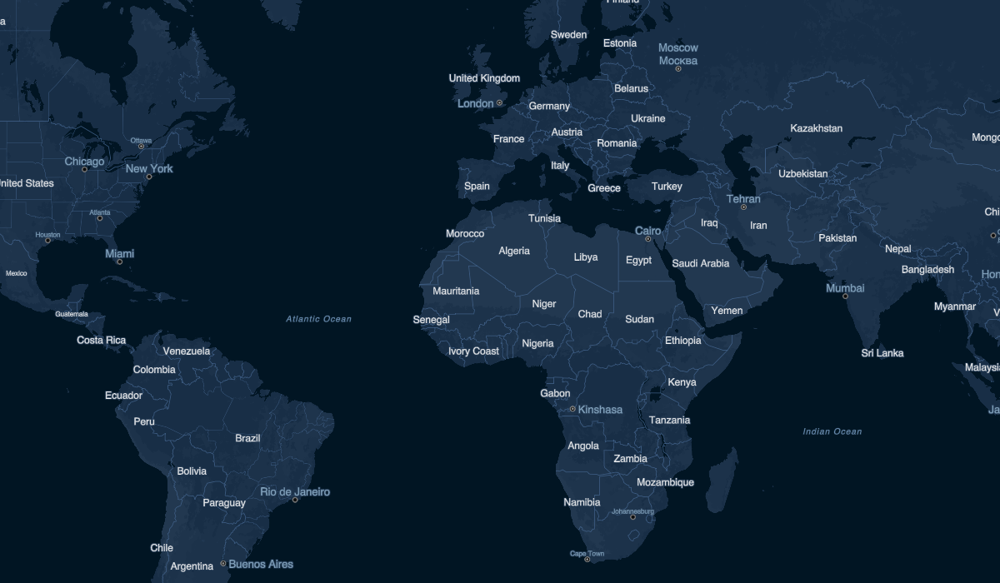
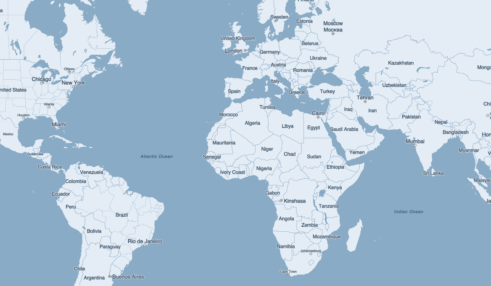

# PM Tile Server

Self-hosted map tile service using [Protomaps](https://protomaps.com) planet tiles, served by [Caddy](https://caddyserver.com) with the [pmtiles plugin](https://github.com/protomaps/go-pmtiles), and an example [MapLibre GL](https://maplibre.org) web client.

## Prerequisites

- Docker and Docker Compose

## Usage

### 1. Download the planet tile

```sh
./download.sh
```

This builds and runs a container that downloads the latest planet tile (~110 GB) into `./data/`. Downloads resume automatically if interrupted and retry up to 10 times with exponential backoff. Safe to run on a cron schedule — concurrent invocations are prevented by a lock file.

### 2. Start the tile server

```sh
docker compose up
```

Opens on [http://localhost:8080](http://localhost:8080).

### 3. View the map

Open [http://localhost:8080](http://localhost:8080) in a browser. Use the style selector to switch between light, dark, white, grayscale, black, and the custom Blueberry themes.

### Custom themes

The example app includes two custom map themes:

- **Blueberry** — a dark navy theme with a subdued label hierarchy
- **Blueberry Milk** — a matching light theme with dark labels on a pale blue background




Both use the [Inter](https://rsms.me/inter/) font, served locally as PBF glyphs.

### Custom font glyphs

Map labels require fonts in PBF (SDF glyph) format. A generation script is included at `fonts/generate-glyphs.sh`.

**Prerequisites:**

```sh
cargo install build_pbf_glyphs
```

**To add a new font:**

1. Place `.ttf` or `.otf` files in `fonts/input/`
2. Run the script:

```sh
./fonts/generate-glyphs.sh
```

This generates PBF glyph ranges in `fonts/output/<FontName>/` which Caddy serves at `/fonts/{fontstack}/{range}.pbf`.

To process a single font file:

```sh
./fonts/generate-glyphs.sh MyFont-Regular.ttf
```

## Architecture

```
./download.sh                    docker compose up
     │                                │
     ▼                                ▼
┌──────────┐    ./data/       ┌─────────────────────┐
│Downloader│───────────────▶  │ Caddy + pmtiles     │
│(one-shot)│  planet.pmtiles  │                     │
└──────────┘  (symlink)       │  :80 -> :8080       │
                              │  /tiles/*  tiles    │
                              │  /*        web app  │
                              └─────────────────────┘
```

## Project Structure

```
├── docker-compose.yml        # Caddy service
├── download.sh               # Runs the downloader container
├── caddy/
│   ├── Dockerfile            # Caddy + pmtiles plugin (xcaddy)
│   └── Caddyfile
├── downloader/
│   ├── Dockerfile            # Alpine + curl + flock
│   └── download-tile.sh
├── web/
│   └── index.html            # MapLibre GL map viewer
├── fonts/
│   ├── generate-glyphs.sh    # Font to PBF glyph converter
│   ├── input/                # Source .ttf/.otf files (gitignored)
│   └── output/               # Generated PBF glyphs, served by Caddy
└── data/                     # Tile storage (gitignored)
```

## License

MIT
